# *Running GUI Application on Top of Docker Container*

### What is Container?
> A container is a standard unit of software that packages up code and all its dependencies so the application runs quickly and reliably from one computing environment to another. A Docker container image is a lightweight, standalone, executable package of software that includes everything needed to run an application: code, runtime, system tools, system libraries, and settings. Container images become containers at runtime and in the case of Docker containers - images become containers when they run on Docker Engine.

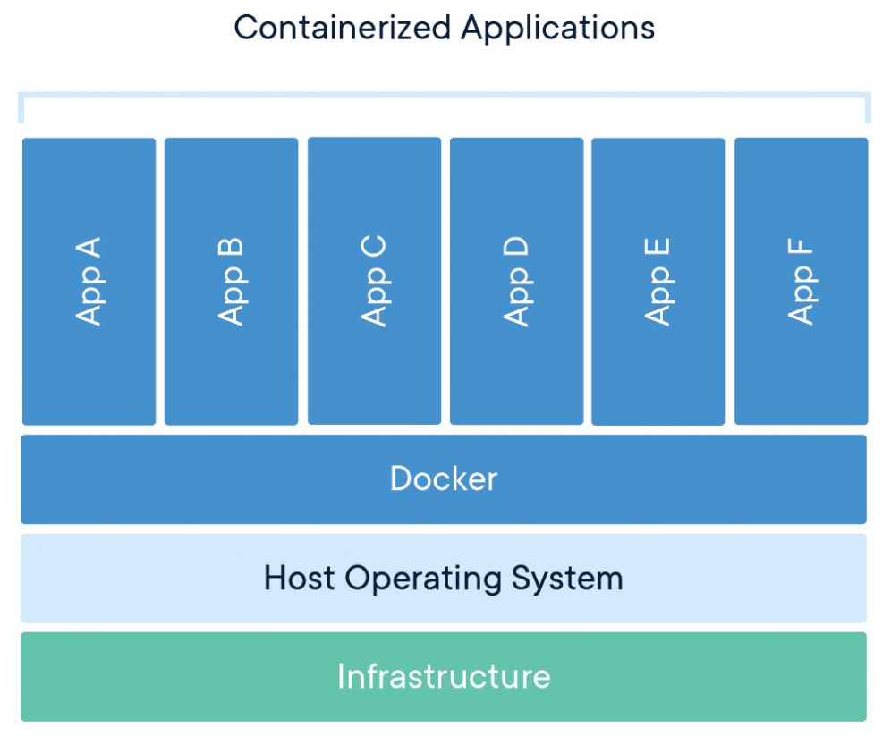

> **Containers and virtual machines have similar resource isolation and allocation benefits but function differently because containers virtualize the operating system instead of hardware. Containers are more portable and efficient.**

### Task To Do:
* Launch a GUI Application inside the Docker Container

### Requirement:
* Docker Installed in the system
* Host OS with GUI

## Lets Begin:
* At the most let’s check whether the docker is installed in the system or not using the `docker info` command

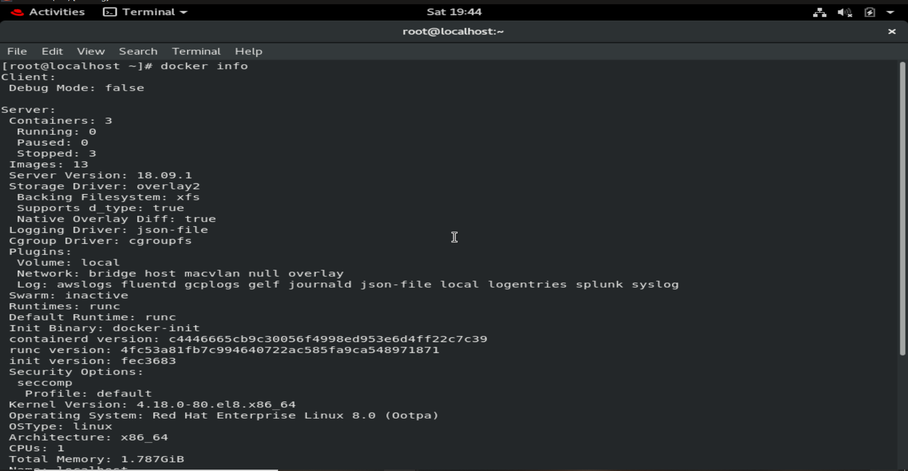

* Now here I am going to install Jupiter notebook and firefox on top of the centos container of the latest version. for which I need centos: latest image for getting this image we use the command docker pull centos: latest
`docker pull centos:latest`

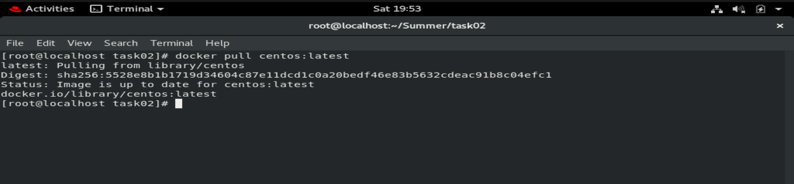

* Now using this as a base image we can create our customized image. For which we have 2 methods Dockerfile and Docker commit.

* In the docker commit, we first create and set up the environment manually by launching one container and configuring the environment in it. now with the help of this container, we create a Docker image

* So let’s first launch a docker container and get the required software in it (Firefox, python3, etc).
command:
`docker run -it --name os1 centos:latest`

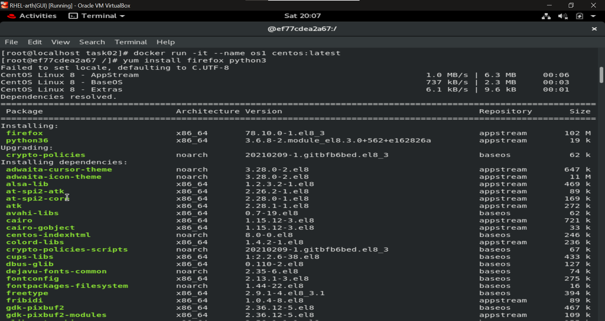

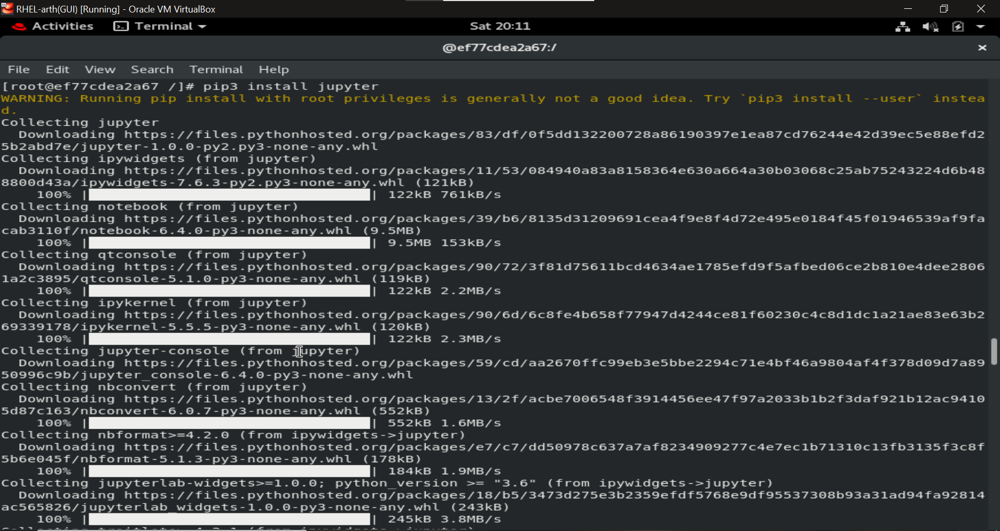

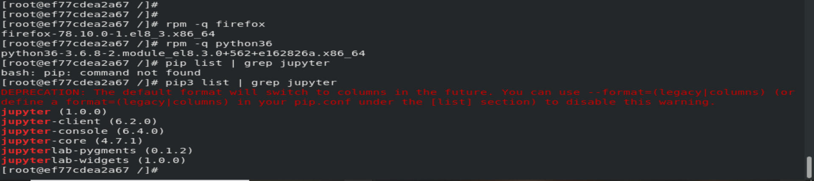

* Now we will exit this container and create an docker image with it. using command:
```
docker commit <container_name> <name_of_container_image_to_create>
```

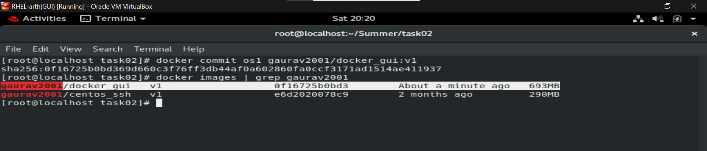

* Now we are ready with the docker image compromising of the required Softwares

* Now while we launch the container from this image we need to ask the processes running in the container to use the X server. X provides the basic framework for a GUI environment: drawing and moving windows on the display device and interacting with a mouse and keyboard. It is already present in the Host system

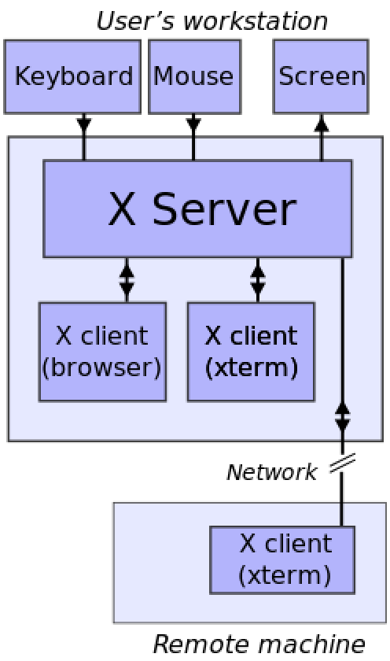

* In this case, Firefox, Jupiter, etc are the clients of the X-server.

* From the Base os also we need to disable authentication using command
`xhost +` for checking the status we can use `xhost`

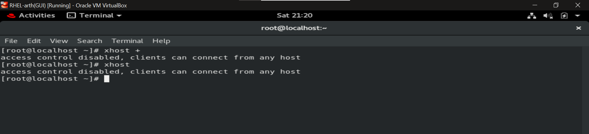

* So now to tell container to use host OS x server first set DISPLAY env variable in the container using -e option. (In the base OS we already have value of DISPLAY set as :1)

* Further we need to mount /tmp/.X11-unix/ in base os to /tmp/.X11-unix/ in container also give required permission on this

```
docker run -it --name test_os -e DISPLAY=$DISPLAY -v /tmp/.X11-unix:/tmp/.X11-unix:rw gaurav2001/docker_gui:v1
```
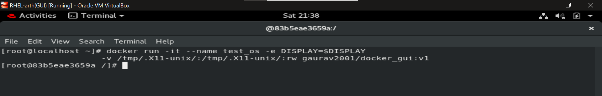

* Now lets run the Jupiter notebook on top of Firefox

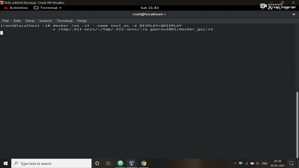

### References:
 ✔ [Docker](https://www.docker.com/resources/what-container)</br>
 ✔ [X server arch.](https://en.wikipedia.org/wiki/X_Window_System_protocols_and_architecture)</br>

 ## Thankyou For Reading
 Any query and suggestion are always welcome- [Gaurav Pagare](https://www.linkedin.com/in/gaurav-pagare-8b721a193/)
